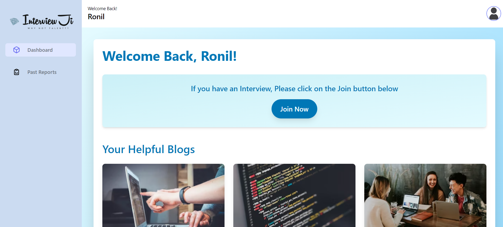
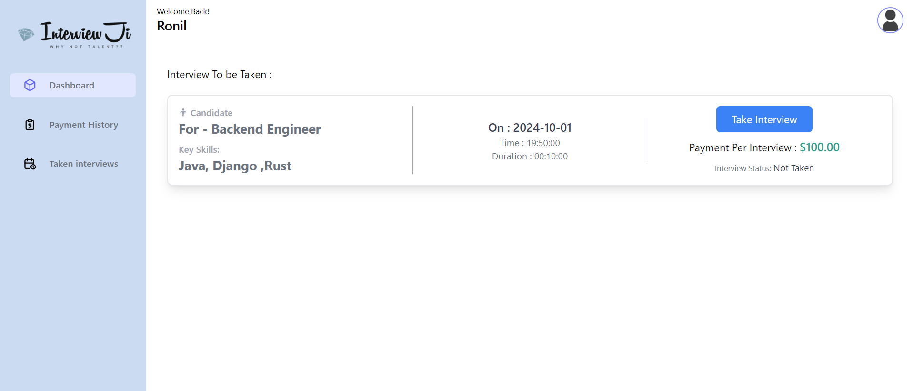
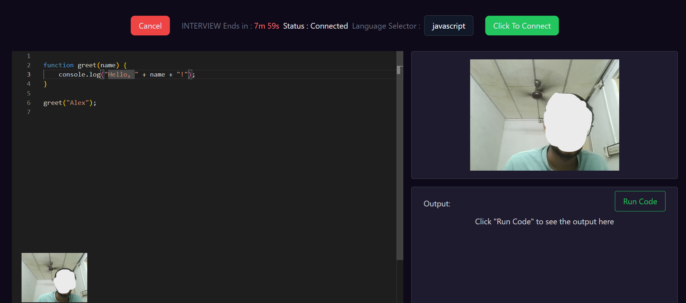

# InterviewJi - Streamlined Technical Interview Platform

**InterviewJi** is a platform designed to streamline the recruitment process for IT and related job roles. The platform offers specialized technical interview services, including mock interviews and technical round filtering. The project uses **React (Vite)** for the frontend, **Django** for the backend, and incorporates **WebRTC**, **Sockets**, and **TailwindCSS** for styling.

## Features

- **Real-Time Code Collaboration:** Enables live coding sessions using WebRTC for video and WebSockets for real-time communication between the Interview Engineer (IE) and candidates.
- **Technical Interview Scheduling:** Supports scheduling interviews based on available time slots for Interview Engineers.
- **Interview Role & Technology Filters:** Offers filtering based on job roles like Full-Stack Developer, DevOps Engineer, Application Developer, and Data Scientist/ML Engineer.
- **OTP Generation:** Secure one-time password (OTP) generation with expiration for accessing interview sessions.
- **Mock Interview Services:** Provides mock interview options to help candidates prepare for real technical rounds.
- **Responsive Design:** Built with TailwindCSS to ensure seamless user experience across devices.

## Tech Stack

- **Frontend:** React (Vite)
- **Backend:** Django (Django REST Framework)
- **Database:** PostgreSQL (pgAdmin)
- **Real-Time Communication:** WebRTC, Socket.io
- **Styling:** TailwindCSS


## Real-Time Features (WebRTC & WebSockets)
Make sure your WebRTC and Socket.io configurations are correctly set up for video calling and real-time communication. Refer to the WebRTC Setup and Socket Setup documentation for any specific details.

## Usage
- Users can sign up for mock interviews or be invited by companies for technical interviews.
- Interview Engineers can schedule interviews based on their expertise and availability.
- Real-time coding and video sessions can be conducted between Interview Engineers and candidates.
- The OTP generation system ensures that only authorized users can access scheduled interviews.

## Contributing
Contributions are welcome! If you’d like to improve the platform or add new features, please submit a pull request.

## Installation

### Backend Setup (Django)

1. Clone the repository:
   ```bash
   git clone https://github.com/ronilkansoda/Interview_JI.git

2. To Run Frontend server:
   ```bash
    cd interviewji/client
    npm i
    npm run dev

3. For Run Socket server:
   ```bash
   cd interviewji/api
   npm i
   npm start

4. To setUp Django server:
   ```bash
   cd interviewji/server
   
5. To setUp Django server:
   ```bash
    set this in settings
    
    EMAIL_HOST_USER,
    EMAIL_HOST_PASSWORD,
    PASSWORD: YourPassword,
    HOST: YourHost,
    PORT: yourPort,

    and 

    pip install djangorestframework django-cors-headers


6. To Run Django server:
   ```bash
   python manage.py makemigrations
   python manage.py migrate
   python manage.py runserver


## Client Screenshot



## Interviewer Screenshot



## Interview Panel Screenshot


